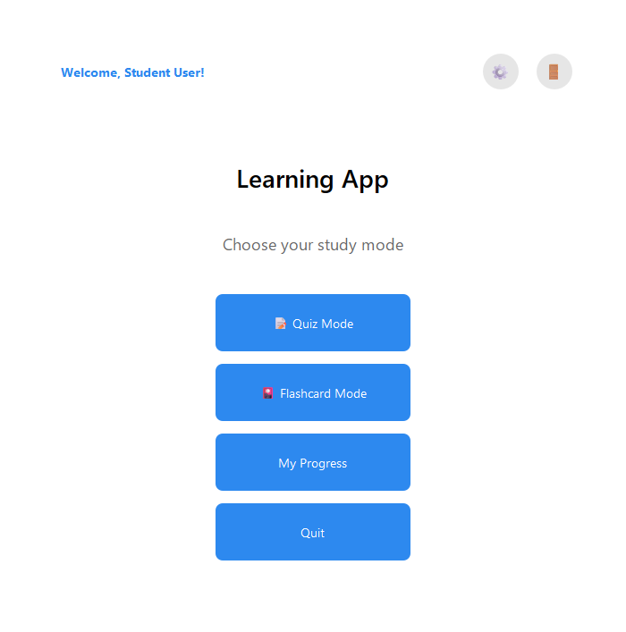
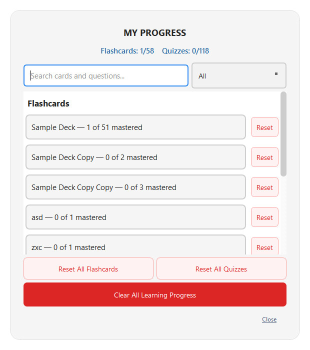
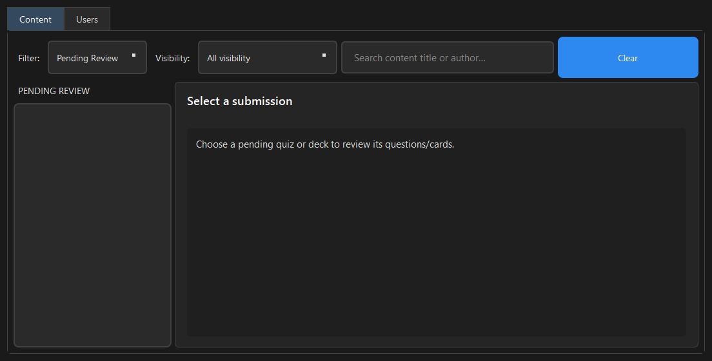

# Study Buddy

Study Buddy is a local desktop learning application built with Python and
PyQt6. It combines quizzes, adaptive flashcards, progress tracking, content
editing, class invitations, and role-based moderation in one offline-first
application.

## Features

- Six quiz question types: single choice, multiple choice, true/false, short
  answer, matching, and ordering.
- Adaptive flashcard sessions with weighted review, delayed retries, mastery
  tracking, recorded audio, and offline text-to-speech.
- Per-user quiz and flashcard progress, statistics, search, filtering, and
  reset controls.
- Quiz and flashcard editors with image/audio media management and draft,
  class-only, and public visibility.
- Student, teacher, and administrator roles with account and content
  moderation rules.
- Class-only content shared through revocable invitation codes, with teacher
  roster and access management.
- Dedicated quiz Test Mode with persistent attempt history, configurable
  countdown timers, due dates, passing grades, attempt limits, saved pass/fail
  results, explicit interrupted-attempt handling, and teacher-controlled answer
  review.
- Teacher assessment reporting with best/average grades, class averages,
  per-question analytics, submission inspection, and CSV result exports.
- Persistent light/dark themes and English/French language preferences.
- Pluggable repositories: JSON provides the offline/demo mode, while the
  authenticated desktop can route accounts, content, classes, learning state,
  moderation, and audit history through FastAPI to PostgreSQL. Database
  credentials remain on the server.

## Screenshots

| Learner dashboard | Progress tracking |
|---|---|
|  |  |



Additional screens are available in [`docs/screenshots/`](docs/screenshots/).

## Technologies

- Python 3.10+
- PyQt6 and Qt Multimedia/Text-to-Speech
- QSS light and dark themes
- JSON persistence
- FastAPI and Uvicorn (local identity API)
- SQLAlchemy 2, Alembic, psycopg, and PostgreSQL (incremental migration)
- pytest
- Git and GitHub

## Architecture

```text
PyQt6 UI
   -> Controllers
      -> Learning logic and access rules
         -> Repository contracts
            -> JSON, PostgreSQL, or the staged HTTP API
```

The UI delegates application flow to controllers, while repositories own file
access and persistence. Shared configuration and access definitions prevent
paths, roles, visibility values, and lifecycle states from being duplicated.

See [docs/architecture.md](docs/architecture.md) for the detailed component and
storage design.

## Project structure

```text
StudyBuddy/
|-- data/                 # Content, users, settings, progress, and media
|-- docs/                 # Architecture, testing, and screenshots
|-- src/
|   |-- api/              # Local FastAPI identity endpoints
|   |-- controllers/      # Application coordination
|   |-- logic/            # Learning and permission rules
|   |-- storage/          # Repository contracts and JSON/PostgreSQL/HTTP adapters
|   |-- ui/               # PyQt6 windows and dialogs
|   `-- utils/            # Paths, logging, audio, and TTS
|-- migrations/           # Alembic database migrations
|-- styles/               # Dark and light QSS themes
|-- tests/                # Automated pytest suite
|-- requirements.txt
`-- run_tests.py
```

The complete layout is documented in
[docs/architecture.md](docs/architecture.md#project-layout).

## Installation

Windows is the primary supported platform. From PowerShell in the project
directory:

```powershell
py -m venv .venv
.\.venv\Scripts\python.exe -m pip install --upgrade pip
.\.venv\Scripts\python.exe -m pip install -r requirements.txt
.\.venv\Scripts\python.exe -m src.main
```

Qt uses the system's configured output device for recorded audio and local
text-to-speech.

## Testing

Install the development dependencies and run:

```powershell
.\.venv\Scripts\python.exe -m pip install -r requirements-dev.txt
.\.venv\Scripts\python.exe run_tests.py
```

**158 pytest cases are collected (157 pass locally and one optional live-
PostgreSQL smoke test is skipped), providing 52.7% overall branch coverage. Core controllers
achieve 87.5% branch coverage and utilities 98.5%; the lower overall figure is
primarily caused by intentionally lightly tested PyQt presentation code.** The
controller, Quiz/Test Mode controller, and utility regression floors are 80%,
80%, and 90%, respectively. Tests cover core learning logic, grading, repositories,
progress, sessions, permissions, invitations, editor controllers, mocked
audio/TTS behavior, and selected high-value UI behavior such as authentication
validation, enrollment feedback, role-gated actions, and test-attempt gating.
The normal command also creates
an interactive report at `htmlcov/index.html`; visual PyQt and real-device
output remain manual.

See [docs/testing.md](docs/testing.md) for the complete test inventory and
testing strategy.

## Future plans

1. Add multi-device identity, secure remote sessions, account recovery, and
   synchronized progress.
2. Add a deliberate offline/download system:
   bundled demo decks, metadata-first public downloads, explicit class-content
   acceptance, versioned synchronization that preserves progress, and cached
   account-owned content that is locked—not deleted—on logout. Public downloads
   may remain available offline; class/personal cloud content requires the
   matching signed-in account, with a separate Clear Downloaded Data action.

## Documentation

- [Architecture and project structure](docs/architecture.md)
- [PostgreSQL migration and local setup](docs/database.md)
- [Proposed PostgreSQL ER diagram](docs/study_buddy_erd.md)
- [Testing strategy and test inventory](docs/testing.md)
- [Screenshot catalog](docs/screenshots/README.md)
