# Study Buddy — PostgreSQL ER Diagram

This ER diagram is the proposed relational model for the current
Study Buddy / FlashcardApp domain. It follows the repository's existing
separation of UI, controllers, learning/access logic and persistence,
while replacing JSON persistence with PostgreSQL for the planned API phase.

The current project has stable content/question/card IDs, per-user progress,
class-only invitations, moderation/lifecycle state, six quiz question types,
persistent Test Mode attempts, and content-owned media. The schema keeps
those concepts explicit rather than mirroring the JSON folder layout.

## ER diagram

```mermaid
erDiagram

    USERS ||--o| USER_SETTINGS : has
    USERS ||--o{ USER_SESSIONS : creates

    USERS ||--o{ FLASHCARD_DECKS : owns
    FLASHCARD_DECKS ||--o{ FLASHCARDS : contains
    USERS ||--o{ FLASHCARD_PROGRESS : earns
    FLASHCARD_DECKS ||--o{ FLASHCARD_PROGRESS : tracked_for

    USERS ||--o{ QUIZZES : owns
    QUIZZES ||--o{ QUIZ_QUESTIONS : contains
    QUIZ_QUESTIONS ||--o{ QUESTION_OPTIONS : has
    QUIZ_QUESTIONS ||--o{ MATCHING_PAIRS : has
    QUIZ_QUESTIONS ||--o{ SHORT_ANSWER_VARIANTS : accepts

    USERS ||--o{ QUIZ_QUESTION_PROGRESS : earns
    QUIZZES ||--o{ QUIZ_QUESTION_PROGRESS : tracked_for

    USERS ||--o{ QUIZ_ATTEMPTS : makes
    QUIZZES ||--o{ QUIZ_ATTEMPTS : receives
    QUIZ_ATTEMPTS ||--o{ QUIZ_ATTEMPT_ANSWERS : contains
    QUIZ_QUESTIONS ||--o{ QUIZ_ATTEMPT_ANSWERS : answered_in

    USERS ||--o{ CLASSES : owns
    CLASSES ||--o{ CLASS_MEMBERS : has
    USERS ||--o{ CLASS_MEMBERS : joins

    CLASSES ||--o{ CLASS_INVITATIONS : exposes
    USERS ||--o{ CLASS_INVITATIONS : creates

    CLASSES ||--o{ CLASS_QUIZZES : shares
    QUIZZES ||--o{ CLASS_QUIZZES : assigned_to

    CLASSES ||--o{ CLASS_FLASHCARD_DECKS : shares
    FLASHCARD_DECKS ||--o{ CLASS_FLASHCARD_DECKS : assigned_to

    USERS ||--o{ MEDIA : owns
    FLASHCARDS ||--o{ FLASHCARD_MEDIA : uses
    MEDIA ||--o{ FLASHCARD_MEDIA : attached_to

    QUIZ_QUESTIONS ||--o{ QUESTION_MEDIA : uses
    MEDIA ||--o{ QUESTION_MEDIA : attached_to

    FLASHCARD_DECKS ||--o{ DECK_MODERATION_HISTORY : has
    QUIZZES ||--o{ QUIZ_MODERATION_HISTORY : has
    USERS ||--o{ DECK_MODERATION_HISTORY : performs
    USERS ||--o{ QUIZ_MODERATION_HISTORY : performs

    FLASHCARD_DECKS ||--o{ DECK_EDIT_HISTORY : has
    QUIZZES ||--o{ QUIZ_EDIT_HISTORY : has
    USERS ||--o{ DECK_EDIT_HISTORY : changes
    USERS ||--o{ QUIZ_EDIT_HISTORY : changes

    USERS ||--o{ ACCOUNT_MODERATION_HISTORY : is_target
    USERS ||--o{ ACCOUNT_MODERATION_HISTORY : performs


    USERS {
        varchar id PK
        varchar username UK
        varchar email UK
        text password_hash
        varchar display_name
        user_role role
        account_status status
        text ban_reason
        timestamptz banned_at
        timestamptz created_at
        timestamptz updated_at
    }

    USER_SETTINGS {
        varchar user_id PK, FK
        varchar language_code
        varchar theme
        integer launcher_width
        integer launcher_height
        jsonb window_sizes
        jsonb extra_preferences
    }

    USER_SESSIONS {
        uuid id PK
        varchar user_id FK
        text session_token_hash UK
        timestamptz created_at
        timestamptz expires_at
        timestamptz revoked_at
    }

    FLASHCARD_DECKS {
        uuid id PK
        varchar owner_id FK
        varchar source_owner_id
        varchar name
        text description
        content_lifecycle lifecycle
        content_visibility visibility
        text source_path UK
        timestamptz created_at
        timestamptz updated_at
    }

    FLASHCARDS {
        varchar deck_id PK, FK
        varchar card_id PK
        text front_text
        text back_text
        text hint_text
        text description_text
        integer position
    }

    FLASHCARD_PROGRESS {
        varchar user_id PK, FK
        varchar deck_id PK, FK
        varchar card_id PK
        integer correct_count
        integer wrong_count
        boolean mastered
        timestamptz updated_at
    }

    QUIZZES {
        uuid id PK
        varchar owner_id FK
        varchar source_owner_id
        varchar name
        text description
        content_lifecycle lifecycle
        content_visibility visibility
        text source_path UK
        integer time_limit_seconds
        timestamptz available_from
        timestamptz due_at
        numeric passing_grade_percent
        integer max_attempts
        boolean allow_answer_review
        timestamptz created_at
        timestamptz updated_at
    }

    QUIZ_QUESTIONS {
        varchar quiz_id PK, FK
        varchar question_id PK
        varchar question_type
        text question_text
        integer position
        jsonb correct_answer
    }

    QUESTION_OPTIONS {
        varchar quiz_id PK, FK
        varchar question_id PK, FK
        integer position PK
        text option_text
        boolean is_correct
    }

    MATCHING_PAIRS {
        varchar quiz_id PK, FK
        varchar question_id PK, FK
        integer position PK
        text prompt
        text answer
    }

    SHORT_ANSWER_VARIANTS {
        varchar quiz_id PK, FK
        varchar question_id PK, FK
        integer position PK
        text answer_text
    }

    QUIZ_QUESTION_PROGRESS {
        varchar user_id PK, FK
        varchar quiz_id PK, FK
        varchar question_id PK
        integer correct_count
        integer wrong_count
        boolean mastered
        timestamptz updated_at
    }

    QUIZ_ATTEMPTS {
        varchar id PK
        varchar user_id FK
        varchar quiz_id FK
        varchar status
        timestamptz started_at
        timestamptz last_activity_at
        timestamptz submitted_at
        timestamptz interrupted_at
        integer score
        integer total
        numeric percentage
        boolean passed
        varchar resolved_by FK
        timestamptz resolved_at
        varchar resolution
    }

    QUIZ_ATTEMPT_ANSWERS {
        varchar id PK
        varchar attempt_id FK
        varchar question_id
        jsonb user_answer
        jsonb correct_answer
        boolean is_correct
        numeric response_seconds
    }

    DECK_EDIT_HISTORY {
        uuid id PK
        uuid deck_id FK
        varchar changed_by FK
        user_role actor_role
        varchar action
        text change_summary
        jsonb changed_fields
        timestamptz changed_at
    }

    QUIZ_EDIT_HISTORY {
        uuid id PK
        uuid quiz_id FK
        varchar changed_by FK
        user_role actor_role
        varchar action
        text change_summary
        jsonb changed_fields
        timestamptz changed_at
    }

    CLASSES {
        uuid id PK
        varchar owner_id FK
        varchar name
        class_status status
        timestamptz created_at
        timestamptz updated_at
    }

    CLASS_MEMBERS {
        uuid class_id PK, FK
        varchar user_id PK, FK
        membership_status status
        timestamptz joined_at
        timestamptz removed_at
    }

    CLASS_INVITATIONS {
        uuid id PK
        uuid class_id FK
        varchar created_by FK
        varchar display_code
        varchar normalized_code UK
        invitation_status status
        timestamptz created_at
        timestamptz revoked_at
    }

    CLASS_QUIZZES {
        uuid class_id PK, FK
        uuid quiz_id PK, FK
    }

    CLASS_FLASHCARD_DECKS {
        uuid class_id PK, FK
        uuid deck_id PK, FK
    }

    MEDIA {
        varchar id PK
        varchar owner_id FK
        varchar media_type
        text storage_key UK
        text original_filename
        varchar mime_type
        integer size_bytes
        varchar checksum_sha256
    }

    FLASHCARD_MEDIA {
        varchar deck_id PK, FK
        varchar card_id PK, FK
        varchar media_id PK, FK
        varchar role PK
    }

    QUESTION_MEDIA {
        varchar quiz_id PK, FK
        varchar question_id PK, FK
        varchar media_id PK, FK
        varchar role PK
    }

    DECK_MODERATION_HISTORY {
        uuid id PK
        uuid deck_id FK
        varchar moderator_id FK
        moderation_action_type action
        content_lifecycle previous_lifecycle
        content_lifecycle new_lifecycle
        content_visibility previous_visibility
        content_visibility new_visibility
        text reason
        timestamptz created_at
    }

    QUIZ_MODERATION_HISTORY {
        uuid id PK
        uuid quiz_id FK
        varchar moderator_id FK
        moderation_action_type action
        content_lifecycle previous_lifecycle
        content_lifecycle new_lifecycle
        content_visibility previous_visibility
        content_visibility new_visibility
        text reason
        timestamptz created_at
    }

    ACCOUNT_MODERATION_HISTORY {
        uuid id PK
        varchar target_user_id FK
        varchar moderator_id FK
        account_status previous_status
        account_status new_status
        text reason
        timestamptz created_at
    }
```



## Main design decisions

### 0. User IDs remain string-compatible during the hybrid migration

The existing JSON content already references numeric-string IDs such as `"1"`
as well as UUID strings. The user tables therefore begin with `VARCHAR(64)`
keys so the user repository can move first without breaking content ownership.
New accounts still receive UUID strings. A native PostgreSQL UUID conversion
can happen later as one atomic migration across users and every owner foreign
key.

User settings keep stable theme/language and launcher columns, but store
per-window geometry in JSONB. This avoids a schema migration whenever a new
resizable PyQt window is introduced.

### 1. Lifecycle and visibility are separate

The current application explicitly treats lifecycle and visibility as independent:

- lifecycle: `draft`, `pending_review`, `published`, `rejected`, `banned`
- visibility: `private`, `class_only`, `public`

The database therefore keeps them as two independent enum columns.

### 2. Progress belongs to the user/content relationship

`FLASHCARD_PROGRESS` and `QUIZ_PROGRESS` use composite primary keys:

- `(user_id, flashcard_id)`
- `(user_id, quiz_id)`

This prevents progress from accidentally becoming global content state.

### 3. Test Mode has both aggregate progress and attempt history

`QUIZ_PROGRESS` is the fast aggregate used for dashboards/statistics.

`QUIZ_ATTEMPTS` stores individual submissions, including:

- in-progress attempts
- completed attempts
- abandoned attempts
- expired attempts
- teacher resolution

`QUIZ_ATTEMPT_ANSWERS` stores the answer for each question.

### 4. Question definitions are relational

Choice questions use `QUESTION_OPTIONS`.

Matching questions use `MATCHING_PAIRS`.

Short-answer questions use `SHORT_ANSWER_VARIANTS`.

Ordering questions reuse the question's ordered answer/options representation at the application/API layer.

The submitted answer itself is `JSONB`, because the six question types naturally produce different answer shapes.

### 5. Media is metadata, not binary storage

The database stores `storage_key`, MIME type, size and checksum.

The actual image/audio file should remain in local storage during the local-server stage and move to object storage during cloud deployment.

### 6. Class access is explicit

A `class_quizzes` or `class_flashcard_decks` row associates content with a class.

`class_members` represents enrollment.

`class_invitations` represents revocable enrollment secrets.

### 7. Guest users are not database users

A guest session can exist at the application level without creating an account row. Once authentication is introduced, the server owns the authenticated identity.

## Expected migration architecture

```text
PyQt6 client
      |
      | HTTPS / JSON
      v
Python API
      |
      +--------------------+
      |                    |
      v                    v
PostgreSQL           Object storage
(users, content,     (images/audio)
 progress, attempts)
```

The database schema is therefore deliberately independent of the current JSON directory layout.
